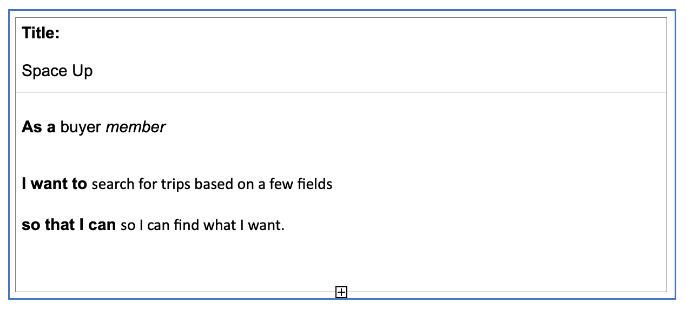

# Space Up

# Purpose

Technology today is running as faster as usual nowadays. So why not create a trend for the future, an opportunity to travel around space. An extraordinary experience to travel around another "world." I made the app to allow the user to have a space trip, and the sellers can have the opportunity to sell packet trips to the user.
The main focus of an application is to apply my skills about ruby on rails and design an app with tables and its relations, and understanding about ERD and design and how I can set an authorisation on my application.
Deployment and have third party services applied on the app.

1. Why build a Space Up application?

The app creates the expectation to have a unique experience of travelling beyond imagination. Travel around the space is nothing like we have seen lately!!! 

# Links

1. You can visit my website through the link: [Space UP](https://space-up.herokuapp.com)

1. My GitHub [Repo](https://github.com/NatachaBartu/space-up)

1. My trello [Trello](https://trello.com/b/dyHHSg9z/marketplace-project)

# Functionality 

The website will be landed on the home page.
The application has Users that can be sellers or buyers. 
Both users, sellers and buyers, need a request to sign up.
The app can have many User selling trips, and also it has been arranged by authorisation on the built application. You can update and delete the trips with the respective id user.
User buyer can select the trip that would like to go, and it will also connect to the Stripe Checkout, which has been implemented on the application.

# Features

For the MVC application, I used the following features:
- Create a User table with Devise for authentication.

Create models and associate the tables. 
- Profile
- Trips
- Orders
- Address
- Cabin 
- Planets

Stripe implementation.

Aws -  Active Storage for uploading files.

Deployed by Heroku.

# User stories

# Wireframes

### Desktop

### Ipad

### Mobile

# ERD 

I've got couple ERDs during the process on implementation of the app.

### ERD 1

### ERD 2

### ERD 3

### ERD 4

### ERD 5

### Final ERD

# Explanation of my ERD

### Profile table
The Profile table belongs to a User.
It has a primary key profile_id.
It has the foreign key user_id.
First_name and Last_name as a string.
Users table
Has one Profile.
Has one Address has many Trips.
Has many sold Orders.
Has many bought Orders. 
I have user_id as a primary key.
Username as string.
Email as string.

### Trips table
Belongs to User.
Belong to Planet.
Belong to Cabin.
It has trip_id as a primary key.
It has three foreign keys user_id, planet_id and cabin_id.
It has a price as an integer.
It has Sold as Boolean.
It has a description as a text.

### Orders table
Belongs to Trip.
Belongs to Buyer.
Belongs to Seller.
It has a primary key, Order_id.
It has three foreign keys buyer_id, trip_id and seller_id.
It has a payment_id as a string.

### Address table
It has one User
It has a primary key address_id.
It has a foreign key, User_id.
It has an address as a text.

### Cabin table
It has a cabin_id, a primary key.
It ahas a name as a string.

### Planets table
It has a primary key as planets_id.
Its have a name as a string.
# Third Party Services

I used a third-party service as Stripe to hold sensitive data for users. 

# Active Record Associations and Database Relation
### Users table

- The User can have just one on profile and one association to address table.
- The Users can have many trips.
- The Users can be also Sellers and Buyers.
- The Users can can have one Order into the relation Order model.
### Profile table
- The profile table belongs to a User.

### Address table
- The address table has one User.

### Trip table
- The trip table belongs to a User table, Planet table and Cabin table.

### Order table
- The Order table belongs to trip table.
- The trip table is also have the buyer and seller which is the Users.
# Schema Design

My schema ERD design

